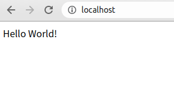

# Node.js(express)の使い方　その①

## 目次 {ignore=true}

<!-- @import "[TOC]" {cmd="toc" depthFrom=2 depthTo=3 orderedList=false} -->

<!-- code_chunk_output -->

- [Node.js(express)の使い方　その①](#nodejsexpressの使い方その)
  - [目次 {ignore=true}](#目次-ignoretrue)
  - [準備](#準備)
    - [Nodejs用のプロジェクトを作成](#nodejs用のプロジェクトを作成)
  - [HTTPサーバーの作成](#httpサーバーの作成)
    - [expressのインストール](#expressのインストール)
    - [server.jsの作成](#serverjsの作成)
    - [実行・終了](#実行終了)
      - [実行](#実行)
      - [終了](#終了)
  - [expressの各種機能](#expressの各種機能)
    - [ファイルの返却](#ファイルの返却)
    - [パラメーター](#パラメーター)
    - [クエリの受け取り](#クエリの受け取り)
      - [GET](#get)
      - [post](#post)
    - [JSONの返却](#jsonの返却)

<!-- /code_chunk_output -->

## 準備

### Nodejs用のプロジェクトを作成

プロジェクトフォルダの作成

```bash
$ mkdir project_name
$ cd project_name
```

packaage.jsonの作成
  
```bash
$ npm init
package name: (project_name) 
version: (1.0.0) 
description: 
entry point: (index.js) 
test command: 
git repository:
keywords: 
author:
license: (ISC) 
```

## HTTPサーバーの作成

### expressのインストール

```bash
npm install express
```

### server.jsの作成

プロジェクトフォルダ内に「server.js」を作成し、以下のコードを記述する。

```js{.line-numbers}
const express = require("express");
const app  = express();
const port = 8080;

// ルーティングの設定
app.get("/", (req, res) =>{
  res.send('Hello World!');
  console.log("access to /");
});

// HTTPサーバを起動する
app.listen(port, () => {
  console.log(`listening at http://localhost:${port}`);
});
```

6行目で`/`のルーティングを行い、アクセスされたら`{}`の処理が実行される。
7行目の`res.send`はレスポンスの処理で、`()`の中の文字列をレスポンスする。
12~14行目でサーバを実行し、ポートに対するアクセスを監視している

### 実行・終了

#### 実行
以下のコマンドを実行してサーバーを起動する

```bash
$ node server.js
listening at http://localhost:8080
```

ブラウザで[http://localhost:8080](http://localhost:8080)にアクセスし、無事にメッセージが表示されたらOK

||
|:--|

#### 終了

このままだと永遠に起動したままになる。終了するには`Ctrl+c`で強制的にプログラムの実行を終了する。

```bash
$ node serve.js
listening at http://localhost:3000
^C
```

## expressの各種機能

### ファイルの返却

`res.send()`は文字列を直接レスポンスするが、`res.sendFile()`は指定したファイルを返却します。__dirnameは現在のディレクトリのパスを示す特殊変数

```js{.line-numbers}
const express = require("express");
const app  = express();
const port = 8080;

// ルーティングの設定
app.get("/", (req, res) =>{
  res.sendFile(`${__dirname}/public/index.html`);
  console.log("access to / ");
});

// HTTPサーバを起動する
app.listen(port, () => {
  console.log(`listening at http://localhost:${port}`);
});
```

プロジェクトフォルダ内に「public」フォルダを作成
publicフォルダ内に「index.html」を作成し、以下のコードを記述する。

```html{.line-numbers}
<!DOCTYPE html>
<html>
<head>
  <meta charset="utf8">
  <title>Example</title>
</head>
<body>

<h1>Hello! Node.js</h1>
<p>I am public/index.html</p>

</body>
</html>
```

ブラウザで[http://localhost:8080](http://localhost:8080)にアクセスし、index.htmlが表示されればOK

### パラメーター

URL事にレスポンスするファイルを変更したい場合、次のように記述しても動作するが、数が多くなると手間がかかる

```js{.line-numbers}
app.get("/a", (req, res) =>{
  res.sendFile(`${__dirname}/public/a.html`);
});
app.get("/b", (req, res) =>{
  res.sendFile(`${__dirname}/public/b.html`);
});
app.get("/c", (req, res) =>{
  res.sendFile(`${__dirname}/public/c.html`);
});
```

そんなときはパラメーター機能を利用する。`:file`の部分でURLからファイル名を取得し、一致したファイルをレスポンスする。一致したファイルは`req.prams.file`で取得できる。
※fileはパラメーター名であり任意の文字に変更可能

```js{.line-numbers}
const express = require("express");
const app  = express();
const port = 8080;

// ルーティングの設定
app.get("/", (req, res) =>{
  res.sendFile(`${__dirname}/public/index.html`);
  console.log("access to /");
});
app.get("/image/:file", (req, res) =>{
  const file = req.params.file;

  res.sendFile(`${__dirname}/public/image/${file}`);
  console.log(`access to /image/${file}`);
});

// HTTPサーバを起動する
app.listen(port, () => {
  console.log(`listening at http://localhost:${port}`);
});
```

publicフォルダ内にimageフォルダを新しく追加し適当な画像をアップロードする。
画像を呼び出すHTMLを以下のように適当に用意します

```html{.line-numbers}
<!DOCTYPE html>
<html>
<head>
  <meta charset="utf8">
  <title>Example</title>
  <style>ul{list-style-type:none; display:flex;}</style>
</head>
<body>

<h1>Hello! Node.js</h1>
<p>I am public/index.html</p>

<ul>
  <li></li>
  <li></li>
  <li></li>
</ul>

</body>
</html>
```

ブラウザで[http://localhost:8080](http://localhost:8080)にアクセスし、各画像にアクセスできていることを確認

Terminal上で合計4回のアクセス(リクエスト)が発生していることがわかる

```bash
$ node serve.js
listening at http://localhost:3000
access to /
access to /image/a.jpg
access to /image/b.jpg
access to /image/c.jpg
```

### クエリの受け取り

ブラウザから引数を受け取る方法

#### GET

[http://localhost:8080/?name=[your name]](http://localhost:8080/)といった感じにアクセスすると、URLの最後につけたクエリーが`req.query.[クエリー名]`で取得できる

```js{.line-numbers}
const express = require("express");
const app  = express();
const port = 8080;

// ルーティングの設定
app.get("/", (req, res) =>{
  const name = req.query.name;
  res.send(`Your Name is ${name}`);
  console.log("access to /");
});

// HTTPサーバを起動する
app.listen(port, () => {
  console.log(`listening at http://localhost:${port}`);
});
```

#### post

```js{.line-numbers}
const express = require("express");
const app  = express();
const port = 8080;

// POSTのクエリーを良い感じに処理する
app.use(express.urlencoded({extended: true}));

// ルーティングの設定
app.post("/", (req, res) =>{
  const name = req.body.name;
  res.send(`Your Name ${name}`);
  console.log("access to /");
});

// HTTPサーバを起動する
app.listen(port, () => {
  console.log(`listening at http://localhost:${port}`);
});
```

9行目の部分はこれまでapp.get()だったがapp.post()に変更されている。ここに書かれていたのはGETやPOSTなどのメソッドのことを示す。今回はPOSTで受け取るのでapp.post()を利用する。
10行目でPOSTで渡されたクエリーを受け取る。req.queryではなくreq.bodyになっている点も注意。

動作は以下のHTMLで確認できる。

```html{.line-numbers}
<form action="http://localhost:3000/" method="POST">
  <input type="text" name="name">
  <button>送信</button>
</form>
```

### JSONの返却

`res.json()`というメソッドが用意されています。このメソッドに引数として連想配列を渡せばいい。

```js{.line-numbers}
const express = require("express");
const app  = express();
const port = 8080;

// ルーティングの設定
app.get("/", (req, res) =>{
  const data = {
    "message": "Hello world",
    "date": "2020-06-29"
  };

  res.json(data);
});

// HTTPサーバを起動する
app.listen(port, () => {
  console.log(`listening at http://localhost:${port}`);
});
```

7〜10行目でデータを用意。
12行目でJSON形式に変換したデータをブラウザに返します。

[http://localhost:8080/](http://localhost:8080/)にアクセスし、引数に渡した連想配列と同じ内容が表示されていればOK
